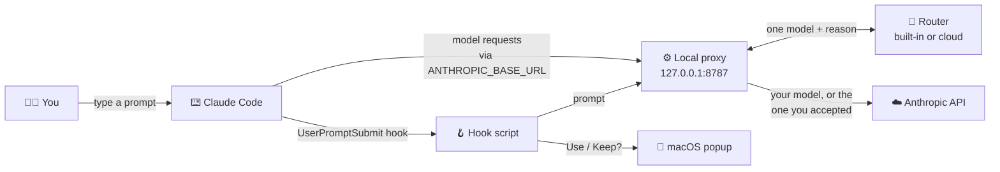
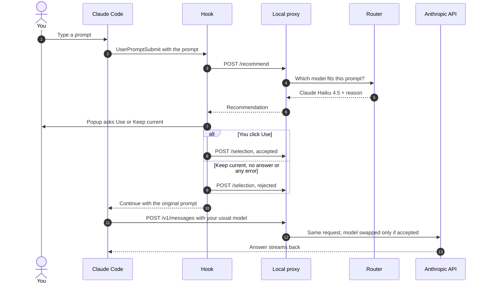

<div align="center">

# 🧭 ModelMatch for Claude Code, Codex and Copilot

**Get the right model for every prompt. Type as usual, ModelMatch suggests the best model, and one click switches to it, without ever leaving your terminal.**

[](https://github.com/UX-ankit1514/ModelMatch/actions/workflows/ci.yml)


</div>

---

## Contents

- [The problem](#the-problem)
- [How it works for people](#how-it-works-for-people)
- [Works with Claude Code, Codex and Copilot](#works-with-claude-code-codex-and-copilot)
- [What it solves](#what-it-solves)
- [How it works under the hood](#how-it-works-under-the-hood)
- [Tech stack](#tech-stack)
- [Repository layout](#repository-layout)
- [Getting started](#getting-started)
  - [Installing on another Mac](#installing-on-another-mac)
  - [Using it with Codex or GitHub Copilot](#using-it-with-codex-or-github-copilot)
- [Configuration](#configuration)
- [Commands](#commands)
- [Connecting the cloud router](#connecting-the-cloud-router)
- [Sharing it](#sharing-it)
- [Security and privacy](#security-and-privacy)
- [Testing](#testing)
- [FAQ and troubleshooting](#faq-and-troubleshooting)
- [Limitations and roadmap](#limitations-and-roadmap)
- [Further documentation](#further-documentation)

---

## The problem

Claude Code answers every prompt with **one model**, whichever you picked last. A quick
*"what's this error?"* gets the same heavyweight model as *"redesign this whole system"*. Switching
means remembering `/model`, guessing which model fits, and switching back afterwards, so in
practice nobody does it.

The [prompt analyzer website](https://workflow-copilot-ten.vercel.app/analyzer) already knows how to pick
the best model for a prompt, but you had to copy the prompt into it to ask.

Picking the model isn't the hard part. Remembering to do it, every single prompt, is.

## How it works for people

ModelMatch moves that decision into Claude Code itself, and asks you only one question:

| Step | Who | What happens |
| :-: | --- | --- |
| 1 | You | Type a prompt in Claude Code, exactly as you do today. |
| 2 | ModelMatch | Reads the prompt *before* Claude does and picks **one** best-fit model. |
| 3 | Your Mac | Shows a small popup: *"Recommended model: Claude Haiku 4.5. Reason: Short, simple request…"* |
| 4 | You | Click **Use Claude Haiku 4.5** or **Keep current**. Do nothing and it keeps your model after 30 seconds. |
| 5 | Claude | Answers with the model you chose. A line under your prompt confirms it: *"ModelMatch: using Claude Haiku 4.5 for this prompt."* |
| 6 | Next prompt | Starts fresh with its own suggestion. Accepting once never changes your next prompt. |

```
┌─────────────────────────────────────────────────────┐
│  ModelMatch                                         │
│                                                     │
│  Recommended model: Claude Haiku 4.5                │
│  Reason: Short, simple request: a fast,             │
│  lightweight model is enough.                       │
│                                                     │
│  Use this model for this prompt?                    │
│                                                     │
│       [ Keep current ]   [ Use Claude Haiku 4.5 ]   │
└─────────────────────────────────────────────────────┘
```

> [!NOTE]
> There are no modes, tiers or settings to learn. Every prompt gets exactly **one** recommendation,
> and nothing changes unless you click **Use**.

### Who uses what

| You are... | You use | You can |
| --- | --- | --- |
| **A Claude Code user** | The popup | Accept or keep a suggestion, pause and resume it |
| **The person installing it** | Terminal and the scripts in [`scripts/`](scripts) | Install for every session or one folder, check health, update, remove |
| **A developer** | This repository | Change routing, add provider adapters, run the tests |
| **The analyzer website** | The [`/api/route`](#connecting-the-cloud-router) endpoint | Supply the real recommendations |

---

## Works with Claude Code, Codex and Copilot

The same popup and the same recommendation, in three tools. Each tool has its own way of running
hooks and switching models, so each gets a small adapter. They share one router, one popup and one
set of settings, and they can be installed side by side.

| | Claude Code | Codex CLI | GitHub Copilot CLI |
| --- | --- | --- | --- |
| **Install** | `bash scripts/install.sh --global` | `bash scripts/install_codex.sh` | `bash scripts/install_copilot.sh` |
| **How it asks you** | `UserPromptSubmit` hook | `UserPromptSubmit` hook | Copilot extension |
| **How the model is switched** | Local proxy for that one prompt | Local proxy for that one prompt | Copilot's own model switch, then back |
| **Models it can switch to** | Claude models | The models in your Codex list | The models in your Copilot plan |
| **One-time step** | None | Trust the hooks with `/hooks` | Copilot needs experimental mode (the installer turns it on) |
| **Scripted runs stay quiet** | `claude -p` | `codex exec` | `copilot -p` |

> [!NOTE]
> Codex and Copilot need their own small helper (port 8788); Claude Code keeps its own (port
> 8787), unchanged. Copilot only changes models between prompts, so a switched prompt appears
> twice in its timeline: once with a one-line note, then answered on the new model. Step-by-step
> instructions, options and troubleshooting are in the
> [Codex and Copilot guide](docs/CODEX-COPILOT-GUIDE.md). How it was designed is in the
> [plan](docs/CODEX-COPILOT-PLAN.md).

---

## What it solves

### ✅ For you as a Claude Code user

- **The right model without thinking about it.** Quick questions go to a fast model, hard problems to a strong one.
- **One click, not a context switch.** No copying prompts into a website, no `/model` juggling.
- **You stay in control.** Nothing switches unless you click **Use**. Ignore the popup and your model stays.
- **You always know what answered.** A one-line note under each prompt says which model was used, and why.
- **Quiet when it should be.** No popup for slash commands, for automated scripts (`claude -p`), or when the best model is already the one you're using.

### 🛡️ Reliable by design

- **It never blocks a prompt.** The hook always lets Claude continue, even if its own file goes missing.
- **Every failure keeps your model.** No internet, a slow router, a crash or a popup that can't open: Claude answers with your usual model and the reason is logged.
- **Bad switches undo themselves.** If Anthropic rejects a request on the recommended model, the proxy retries once with your original model.
- **It heals itself.** The local helper restarts automatically when Claude Code starts and before every prompt.
- **One popup per prompt.** Installed both globally and per folder? A run-once guard still asks only once.

### 🔐 Private by default

- **Your Claude sign-in passes straight through** to Anthropic. It's never stored or logged.
- **Your prompts stay on your Mac** with the built-in recommender. Logs keep only a prompt's length, never its text.
- **Your settings are safe.** Every change is backed up first, and only ModelMatch's own entries are ever touched.

### 💸 Costs nothing to run

- Everything runs **locally on your Mac**: no server, no account, no subscription. Your Claude usage is billed exactly as today. Choosing a lighter model for simple prompts can even reduce it.

### 🔌 Built to grow

- **Recommendation is separate from execution.** ModelMatch can recommend *any* model (GPT, Gemini, …), but only switches when a real adapter can run it. Today that's Claude in Claude Code, and the models in your own Codex list or Copilot plan. A model none of your tools can run is shown as advice and **never faked**.

---

## How it works under the hood



> [!IMPORTANT]
> **Design rule:** recommending and switching are separate steps. The hook *asks*. The proxy
> *switches*, and only for the prompt you accepted. Everything else passes through to Anthropic
> unchanged.

### One prompt from start to finish



- **SessionStart hook:** makes sure the local proxy is running and registers the session. It never routes.
- **UserPromptSubmit hook:** gets one recommendation, asks you, saves the choice, then lets Claude continue.
- **Local proxy:** Claude Code is pointed at it with `ANTHROPIC_BASE_URL`. It forwards every request to Anthropic untouched, except during a turn you accepted. Then it swaps the model and adapts the request to what that model supports.

### The message under your prompt

| Message | What it means |
| --- | --- |
| *ModelMatch: using Claude Sonnet 5.5 for this prompt.* | You clicked **Use**. |
| *ModelMatch: kept your current model (recommended …)* | You clicked **Keep current**. |
| *ModelMatch: no answer within 30s, kept your current model …* | The popup timed out. Nothing changed. |
| *ModelMatch recommends …, which is already your current model.* | You're already on the best model, so no popup. |
| *ModelMatch recommends GPT-4o … isn't set up yet.* | The best fit isn't a Claude model. Shown as advice, nothing switched. |
| *… (Recommendation only: model routing is off for this session.)* | Installed with `--no-routing`, or the session started before you installed. |
| *ModelMatch is unavailable right now …* | Something failed behind the scenes. Claude still answers with your model. |

The deep dive (proxy endpoints, safety checks, the router API) is in [docs/HOW-IT-WORKS.md](docs/HOW-IT-WORKS.md).

---

## Tech stack

| Part | Built with | Runs on |
| --- | --- | --- |
| Hooks | Python 3 standard library: `SessionStart` + `UserPromptSubmit` command hooks (Claude Code, Codex) | Your Mac, inside the tool |
| Copilot extension | JavaScript (Copilot CLI extension API) | Your Mac, inside Copilot CLI |
| Local proxies | FastAPI, uvicorn, httpx (streaming passthrough) | Your Mac, `127.0.0.1:8787` (Claude Code) and `:8788` (Codex) |
| Use / Keep popup | macOS `osascript` dialog, terminal `[Y/n]` fallback | macOS |
| Recommendations | Built-in local recommender, or the cloud router (the analyzer website) | Your Mac / Vercel |
| State | One JSON file, no database | Your Mac |
| Tests and CI | pytest, GitHub Actions (macOS + Linux) | GitHub |

---

## Repository layout

```text
.
├── hooks/
│   ├── modelmatch_hook.py         The hook Claude Code runs (SessionStart + UserPromptSubmit)
│   ├── modelmatch_codex_hook.py   The same hooks for Codex CLI
│   ├── modelmatch_copilot_hook.py The decision script for GitHub Copilot CLI
│   ├── copilot-extension/         The Copilot extension (asks you, switches the model)
│   └── agents_common.py           Code shared by the Codex and Copilot hooks
├── proxy/                         The local proxy (Claude Code)
│   ├── app.py                     Endpoints + passthrough to the Anthropic API
│   ├── router_client.py           Built-in recommender, /api/route and /api/analyze clients
│   ├── provider.py                Model catalog and provider adapters
│   ├── session_store.py           Per-session state (state/sessions.json)
│   ├── config.py                  Settings from .env
│   └── agents/                    The second local proxy, for Codex and Copilot (port 8788)
├── scripts/                       install, uninstall, doctor (also *_codex.sh and *_copilot.sh), pause, resume, package
├── tests/                         Automated tests (pytest)
├── docs/HOW-IT-WORKS.md           Technical deep dive (Claude Code)
├── docs/CODEX-COPILOT-GUIDE.md    Install and use it with Codex and Copilot
├── docs/CODEX-COPILOT-PLAN.md     How the Codex and Copilot versions were designed
├── .github/workflows/ci.yml       Runs the tests on every push
├── .env.example                   Settings template (copied to .env, which is never committed)
└── requirements.txt               Python packages for the proxy
```

---

## Getting started

### Prerequisites

| You need | For |
| --- | --- |
| A Mac | The Use / Keep popup |
| Claude Code, signed in with a Claude subscription or Anthropic API key | Everything |
| Python 3.9+ and Git | Installing and running the proxy. Missing? Run `xcode-select --install` and click **Install**. |

> [!TIP]
> **Never used Terminal?** Press <kbd>⌘ Command</kbd> + <kbd>Space</kbd>, type **Terminal**, press
> <kbd>Return</kbd>. To run a command from this page, copy it, paste it into Terminal
> (<kbd>⌘ Command</kbd> + <kbd>V</kbd>) and press <kbd>Return</kbd>.

### 1. Install

```bash
git clone https://github.com/UX-ankit1514/ModelMatch.git ~/modelmatch
cd ~/modelmatch
bash scripts/install.sh --global
```

This downloads ModelMatch to a **modelmatch** folder in your home folder and turns it
on for **every** Claude Code session. It takes about a minute and ends with a list of green ticks
and **Done.**

### 2. Restart Claude Code and try it

Quit Claude Code completely, open it again, and type any prompt. The popup appears.

### 3. (Optional) Choose how it behaves

| I want… | Run instead of the last line above |
| --- | --- |
| It in **every** Claude Code session *(recommended)* | `bash scripts/install.sh --global` |
| It **only in one project folder** | `bash scripts/install.sh --project ~/path/to/project` |
| **Suggestions only**, never switch models | add `--no-routing` to either line |

> [!WARNING]
> Keep the `modelmatch` folder where it is: Claude Code uses it on every prompt. If you move
> it, run `bash scripts/install.sh --global` again from the new location.

<details>
<summary><b>Install without Git (Download ZIP)</b></summary>

<br>

1. On this page, click the green **Code** button → **Download ZIP**, and open the file.
2. Rename the **ModelMatch-main** folder to **modelmatch** and move it into your home folder (Finder → **Go → Home**).
3. In Terminal: `cd ~/modelmatch && bash scripts/install.sh --global`
4. Restart Claude Code.
</details>

### Installing on another Mac

Want it on a second Mac, or a teammate's? Every Mac gets its own install. Only the code travels.
Each Mac keeps its own settings and logs, and uses its own Claude sign-in.

**On the other Mac:**

1. **Check the basics.** Open Terminal and run `claude` to make sure Claude Code works and is
   signed in. Then run `python3 --version`. It should say 3.9 or newer. If `python3` or `git` is
   missing, run `xcode-select --install` and click **Install**.

2. **Get the code** in one of two ways:

   - **From GitHub:**
     ```bash
     git clone https://github.com/UX-ankit1514/ModelMatch.git ~/modelmatch
     ```
   - **From a file, no GitHub needed:**
     1. On a Mac that already has it, run `bash scripts/package.sh`. This makes a zip in the
        `dist/` folder.
     2. Send the zip by AirDrop, email or Slack.
     3. On the new Mac, double-click it, rename the folder to **modelmatch**, and move it
        into your home folder (Finder → **Go → Home**).

3. **Install:**
   ```bash
   cd ~/modelmatch
   bash scripts/install.sh --global
   ```

4. **Try it.** Quit Claude Code completely, start it again with `claude`, and type any prompt. The
   popup appears.

5. **Check everything** (optional): `bash scripts/doctor.sh`. You get a ✅ or a fix for each
   part.

> [!NOTE]
> - **Use `claude`, not `claude -p`.** Scripted runs (`claude -p`) are skipped on purpose, so you
>   won't see the popup there.
> - **Settings don't travel.** If you set a router URL or key in `.env` on your Mac, set them
>   again on the new one. Never send your `.env` file.
> - **An existing gateway stays in charge.** If the new Mac already sends Claude Code through
>   another gateway (its own `ANTHROPIC_BASE_URL`), the installer won't override it, and you get
>   suggestions only.
> - **To remove it from that Mac:** `bash ~/modelmatch/scripts/uninstall.sh --global`

---

### Using it with Codex or GitHub Copilot

Install ModelMatch first (steps above), then, from the same folder:

| I use | Run | Then |
| --- | --- | --- |
| **Codex CLI** (0.116 or newer) | `bash scripts/install_codex.sh` | Start `codex`, type **`/hooks`** and trust the two ModelMatch hooks. Codex skips new hooks until you do. |
| **GitHub Copilot CLI** (1.0.44 or newer) | `bash scripts/install_copilot.sh` | Restart `copilot`. You'll see "ModelMatch is on…". |

Add `--no-routing` (Codex) or `--hooks-only` (Copilot) for suggestions only, with no switching.
To remove them: `bash scripts/uninstall_codex.sh` or `bash scripts/uninstall_copilot.sh`.
The full guide is [docs/CODEX-COPILOT-GUIDE.md](docs/CODEX-COPILOT-GUIDE.md).

---

## Configuration

| Where | What goes there | Committed? |
| --- | --- | --- |
| `.env` | Router URL and key, popup timeout, port… ([template](.env.example)) | ❌ No |
| `~/.claude/settings.json` | The two hooks + `ANTHROPIC_BASE_URL` when installed with `--global` | ❌ No (your Mac) |
| `<project>/.claude/settings.json` | The two hooks for a one-folder install | ❌ No |
| `<project>/.claude/settings.local.json` | `ANTHROPIC_BASE_URL` for a one-folder install | ❌ No |
| `logs/`, `state/` | Logs and per-session state | ❌ No |

### Settings (`.env`)

| Setting | Default | Controls |
| --- | :-: | --- |
| `MODELMATCH_API_URL` | *empty* | Where recommendations come from. Empty means the built-in recommender. |
| `MODELMATCH_API_KEY` | | Key for the cloud router |
| `MODELMATCH_API_TIMEOUT` | 25 | Seconds to wait for a recommendation |
| `MODELMATCH_CONFIRM_UI` | `auto` | `auto` (popup), `dialog`, `tty`, `auto-accept`, `never` |
| `MODELMATCH_CONFIRM_TIMEOUT` | 30 | Seconds before an unanswered popup keeps your model |
| `MODELMATCH_DISABLED` | 0 | `1` pauses it (use `pause.sh` / `resume.sh`) |
| `MODELMATCH_MAX_PROMPT_CHARS` | 8000 | How much of a prompt is sent to a cloud router |
| `MODELMATCH_UPSTREAM_URL` | `https://api.anthropic.com` | Where Claude Code's requests are forwarded |
| `MODELMATCH_LOG_PROMPTS` | 0 | `1` adds an 80-character prompt preview to logs |
| `MODELMATCH_PORT` | 8787 | Local proxy port |

The hook rereads `.env` on every prompt. After changing router settings, restart the proxy with
`python3 hooks/modelmatch_hook.py --stop-proxy` (it starts again on its own).

---

## Commands

Run these from the `modelmatch` folder.

| Command | What it does |
| --- | --- |
| `bash scripts/install.sh --global` | Install for every Claude Code session (safe to re-run) |
| `bash scripts/install.sh --project DIR` | Install for one project folder |
| `bash scripts/doctor.sh` | Health check, with the exact fix for anything wrong (`--tests` also runs the tests) |
| `bash scripts/pause.sh` / `resume.sh` | Pause / resume, from the next prompt |
| `git pull && bash scripts/install.sh --global` | Update to the newest version |
| `bash scripts/uninstall.sh --global` | Remove it (`--purge` also deletes `.venv`, `logs`, `state`) |
| `python3 hooks/modelmatch_hook.py --status` | Is the local proxy running? (`--start-proxy` / `--stop-proxy`) |
| `bash scripts/package.sh` | Build a shareable zip in `dist/` |
| `.venv/bin/python -m pytest` | Run the tests |

After install, update or uninstall, **restart Claude Code**.

---

## Connecting the cloud router

Recommendations currently come from a **built-in local recommender** (simple rules: short
questions → Haiku, coding → Sonnet, big design work → Opus). The real cloud router
plugs in with one setting.

| Endpoint on the website | Status |
| --- | --- |
| `POST /api/route` | **Not live yet.** This is the endpoint this project is designed for. |
| `POST /api/analyze` | Live. Works as a stopgap, but suggests mostly GPT/Gemini and costs an AI call per prompt. |

Once `/api/route` is live:

```bash
# in .env
MODELMATCH_API_URL=https://workflow-copilot-ten.vercel.app/api/route
MODELMATCH_API_KEY=<key>
```

```http
POST /api/route   {"prompt": "…", "client": "claude-code"}
→ 200             {"recommended_model": "claude-sonnet-5-5", "reason": "…", "confidence": 0.82}
```

The full contract and rehearsal steps are in [docs/HOW-IT-WORKS.md](docs/HOW-IT-WORKS.md#connecting-the-real-cloud-router).

---

## Sharing it

**Send the link:** `https://github.com/UX-ankit1514/ModelMatch`. The steps in
[Installing on another Mac](#installing-on-another-mac) are all anyone needs. Each person gets their own local proxy,
settings and logs, and uses their own Claude sign-in. Nothing is shared between machines.

Prefer a file? `bash scripts/package.sh` builds a zip in `dist/` that you can AirDrop, email or
Slack. It's built from an allow-list and refuses to build if it finds a `.env`, logs, a key or a
personal path.

---

## Security and privacy

| Area | Protection |
| --- | --- |
| **Your Claude sign-in** | Passed straight through to Anthropic. Never stored, never logged. |
| **Your prompts** | With the built-in recommender they never leave your Mac. A cloud router receives at most the first 8,000 characters, once per prompt. Logs record only length and a fingerprint. |
| **Your settings** | Backed up before every change. Only ModelMatch's own entries are touched. Invalid settings files and other gateways' `ANTHROPIC_BASE_URL` are never overwritten. |
| **Prompts are never blocked** | The hook always lets Claude continue, and its command ends in `\|\| true` so even a deleted hook file can't block a prompt. |
| **Model switching** | Only to models your tool can really run (Claude in Claude Code, your Codex list, your Copilot plan). A model it can't run is shown as advice, never faked. |
| **Secrets in Git** | `.env`, logs, state and settings are git-ignored. The zip builder refuses to include them. |

> [!CAUTION]
> With model switching on, Claude Code reaches Anthropic *through* the local proxy. It restarts
> itself automatically, but if it can't run at all Claude Code can't connect. `doctor.sh` spots
> this, and `bash scripts/install.sh --global --no-routing` turns switching off instantly.

---

## Testing

```bash
.venv/bin/python -m pytest        # everything, ~25 s, no network or popups needed
bash scripts/doctor.sh --tests    # health check + tests
```

| Suite | Covers |
| --- | --- |
| [`test_hook.py`](tests/test_hook.py) | The real hook against a real proxy: popup and terminal Use / Keep / timeout, every fail-open case, duplicate hooks, scripted runs, pause |
| [`test_app.py`](tests/test_app.py) | Proxy endpoints, per-turn routing, untouched passthrough, retry with the original model, no prompts or keys in logs |
| [`test_router_client.py`](tests/test_router_client.py) | Built-in recommender, the `/api/route` contract, the `/api/analyze` adapter, timeouts and malformed replies |
| [`test_provider.py`](tests/test_provider.py) | Model names (current, retired, unknown), non-Claude providers, per-model request adjustments |
| [`test_settings_tool.py`](tests/test_settings_tool.py) | Global and folder installs: merging, backups, never overwriting invalid files or another gateway |

GitHub Actions ([`ci.yml`](.github/workflows/ci.yml)) runs the full suite on macOS and Linux on
every push and pull request.

> [!NOTE]
> Automated tests use a stand-in for the macOS popup, since a robot can't click it. To see the
> real popup, install it and type a prompt.

---

## FAQ and troubleshooting

Start with the health check. It names the problem and the exact command that fixes it:
`bash ~/modelmatch/scripts/doctor.sh`

<details>
<summary><b>Claude Code shows a connection or "API" error.</b></summary>

<br>

The local proxy isn't running. Start it:

```bash
python3 ~/modelmatch/hooks/modelmatch_hook.py --start-proxy
```

Still stuck? Turn model switching off. You keep the suggestions, and Claude Code talks to Anthropic
directly again: `bash ~/modelmatch/scripts/install.sh --global --no-routing`, then restart
Claude Code.
</details>

<details>
<summary><b>I don't see the popup.</b></summary>

<br>

Restart Claude Code (sessions opened before installing don't use it). The popup may be behind
another window, so check Mission Control. Make sure it isn't paused:
`bash ~/modelmatch/scripts/resume.sh`.
</details>

<details>
<summary><b>The status bar still shows my usual model.</b></summary>

<br>

That's expected. Claude Code shows the model you chose in `/model`. The note under your prompt
says which model actually answered.
</details>

<details>
<summary><b>It recommended GPT or Gemini but didn't switch.</b></summary>

<br>

Claude Code can only run Claude models, so in Claude Code other recommendations are shown as advice only.
Codex and Copilot switch to the models in your Codex list or Copilot plan. Switching is never faked.
</details>

<details>
<summary><b>"command not found: python3" or "git".</b></summary>

<br>

Run `xcode-select --install`, click **Install**, wait for it to finish, then install again.
</details>

<details>
<summary><b>The installer says "NOT enabling routing".</b></summary>

<br>

Something else (a company gateway, for example) already routes Claude Code's traffic. Workflow
Copilot won't override it, so you get suggestions only. See
[install scopes](docs/HOW-IT-WORKS.md#install-scopes) to chain the two.
</details>

<details>
<summary><b>Does it cost anything? Does it work on Windows or Linux?</b></summary>

<br>

It costs nothing to run: it's all on your Mac. The popup is macOS-only. On other systems the hook
keeps your current model, so it's safe but not useful yet.
</details>

<details>
<summary><b>Where are the logs?</b></summary>

<br>

`~/modelmatch/logs/hook.log` and `proxy.log`. They record suggestions, choices and errors.
Never your prompt text, passwords or keys.
</details>

---

## Limitations and roadmap

**Today**

- macOS only (the popup is a macOS window).
- Claude Code switches between **Claude models** only, and needs to be signed in directly with Anthropic (not Bedrock, Vertex or Foundry). Codex and Copilot switch within your Codex list and Copilot plan.
- Codex runs only hooks you trust (`/hooks`). Copilot's extension feature is still labelled experimental by GitHub.
- The built-in recommender is simple, so you'll see a suggestion on most prompts.

**Next**

- [ ] `/api/route` on the analyzer website, for real recommendations
- [ ] Quieter suggestions once the real router is live (no popup when your model already fits)
- [ ] Provider adapters (OpenRouter and others), so Claude Code can run non-Claude recommendations too

---

## Further documentation

| Document | Read it when you want to... |
| --- | --- |
| [docs/HOW-IT-WORKS.md](docs/HOW-IT-WORKS.md) | Understand the proxy endpoints, install safety checks, router API and known limits |
| [docs/CODEX-COPILOT-GUIDE.md](docs/CODEX-COPILOT-GUIDE.md) | Install and use ModelMatch with Codex CLI and GitHub Copilot CLI |
| [docs/CODEX-COPILOT-PLAN.md](docs/CODEX-COPILOT-PLAN.md) | See how the Codex and Copilot versions were researched and designed |
| [.env.example](.env.example) | See every setting |
| [Claude Code hooks](https://code.claude.com/docs/en/hooks) | Learn how Claude Code hooks work |
| [Codex hooks](https://developers.openai.com/codex/hooks) | Learn how Codex hooks work |
| [Copilot CLI hooks](https://docs.github.com/en/copilot/reference/hooks-reference) | Learn how Copilot CLI hooks work |
| [Prompt analyzer](https://workflow-copilot-ten.vercel.app/analyzer) | Try the prompt analyzer on the web |

---

<div align="center">
<sub>ModelMatch · Runs locally on your Mac · Your own accounts stay yours</sub>
</div>
